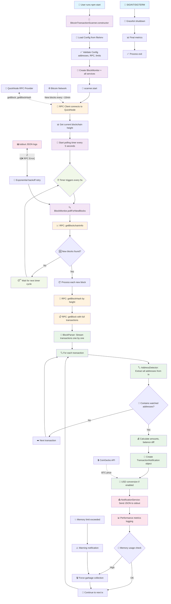

# Bitcoin Transaction Scanner - Data Flow Diagram



## 📋 Detailed Component Flow

### 🚀 **Startup Phase (Once)**
1. **User Input** → `npm start` запускает main()
2. **Constructor** → Создает все сервисы и загружает конфиг
3. **Config Loading** → Читает JSON файл или env переменные  
4. **Service Init** → Создает RPC client, parsers, detectors
5. **Connection** → Подключается к QuickNode Bitcoin RPC
6. **Baseline** → Получает текущую высоту блокчейна

### ⏰ **Timer Loop (Every 5 seconds)**
```
Timer → BlockMonitor → RPC Call → Block Processing → Notifications
```

### 🔄 **Block Processing Pipeline**
```
Raw Block Data → Stream Parser → Address Detection → Notification → stdout
```

### 📊 **Memory Management**
- Каждые 100 транзакций: проверка памяти
- При превышении 80% лимита: garbage collection  
- При превышении лимита: warning уведомление

### 🎯 **Key Service Interactions**

| Service | Responsibility | Input | Output |
|---------|---------------|-------|---------|
| **RPC Client** | Bitcoin network communication | Block height, hash | Raw block data |
| **Block Parser** | Raw data processing | Bitcoin block | Transaction stream |
| **Address Detector** | Pattern matching | Transaction + watched addresses | Match results |
| **Notification Service** | Output formatting | Transaction matches | JSON stdout |

### 💡 **Critical Async Points**
1. **RPC calls** - Network latency, retry logic
2. **Block streaming** - Memory-efficient processing
3. **Address lookup** - O(1) Set operations
4. **USD conversion** - External API calls
5. **JSON logging** - Non-blocking stdout

### 🔥 **Performance Optimizations**
- **Streaming**: No full block caching (512MB limit)
- **Set lookup**: O(1) address detection (1000+ addresses)
- **Async processing**: Parallel transaction analysis
- **Memory monitoring**: Proactive garbage collection
- **Retry logic**: Handles free-tier RPC limits
